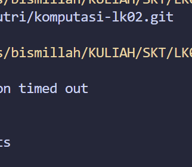

# Laporan Sistem Komputasi Terdistribusi
## Izzah Faiq Putri Madani 235150201111039

---

## Tugas A — MapReduce

### 1. Berapa lama waktu yang dibutuhkan sebelum batch pertama selesai diproses? Mengapa membutuhkan waktu tersebut?



Batch pertama baru bisa diproses setelah **20 pesan terkumpul** di buffer
(sesuai `BATCH_SIZE = 20`). Karena publisher mengirim 5 pesan/detik
(satu per stasiun secara bergantian), buffer penuh setelah ±4 detik. Proses MapReduce seharusnya sangat cepat. Ini adalah ciri khas **batch processing** yaitu terdapat jeda tetap sebelum hasil tersedia, tidak seperti stream processing yang langsung reaktif.

---

### 2. Apa yang terjadi dengan urutan data dari berbagai stasiun saat masuk ke buffer? Bagaimana fase Shuffle menangani hal ini?

Data masuk ke buffer dalam urutan kedatangan MQTT yang bersifat interleaved. Contoh : WS-001, WS-003, WS-002, WS-005, WS-004, WS-001, dst tanpa pengelompokan. Fase Shuffle mengatasinya dengan iterasi seluruh pasangan `(station_id, value)` hasil Map, lalu memasukkannya ke `dict` dengan key = `station_id`. Hasilnya setiap stasiun memiliki list nilai yang sudah dikelompokkan terlepas dari urutan kedatangan asli. Itulah fungsi utama Shuffle yaitu menghilangkan ketergantungan pada urutan input.

---

### 3. Jika `BATCH_SIZE` ditingkatkan menjadi 100, apa dampaknya terhadap akurasi statistik dan latensi hasil?


Peningkatan `BATCH_SIZE` menjadi 100 menciptakan trade-off yang signifikan antara kualitas data dan kecepatan sistem. Dari sisi akurasi statistik, penggunaan sampel yang lebih besar (100 data) menghasilkan nilai rata-rata dan distribusi yang lebih representatif serta stabil terhadap outlier. Namun, hal ini berdampak buruk pada latensi hasil; dengan laju 5 pesan/detik, sistem mengalami penundaan hingga 20 detik hanya untuk mengisi satu batch. Selain menyebabkan data menjadi tidak real-time (data staleness), penggunaan memori juga meningkat proporsional karena buffer harus menampung objek 5 kali lebih banyak. Oleh karena itu, untuk sistem monitoring cuaca yang membutuhkan respon cepat, penggunaan batch size kecil lebih disarankan demi menjaga responsivitas dibandingkan mengejar stabilitas statistik yang tinggi.

---

### 4. **Modifikasi:** Ubah key pada fase Map menjadi `arah_angin` (bukan `station_id`). Apa insight baru yang bisa didapat dari perubahan ini?


Dengan key `arah_angin` (N, NE, SE, S, dll.), fase Reduce menghasilkan statistik
per **arah mata angin**, bukan per stasiun. Insight yang muncul:

- **Korelasi arah angin dengan AQI**: Apakah angin dari arah tertentu (misal dari
  kawasan industri) membawa partikel polutan lebih tinggi?
- **Distribusi hujan per arah**: Apakah hujan lebih sering datang dari arah tertentu
  (terkait pola angin musiman)?
- **Suhu rata-rata per arah**: Angin dari laut (S/SE di Malang) cenderung lebih
  sejuk dibanding angin dari daratan (N/NW).

Ini berguna untuk **analisis meteorologi spasial** yang tidak bisa dilihat dari pengelompokan per-stasiun.

---

## Tugas B — Stream Processing

### 1. Mengapa `defaultdict(lambda: deque(maxlen=N))` lebih tepat digunakan dibanding satu deque global?

Satu `deque` global akan mencampur semua event dari semua stasiun. Jika stasiun WS-001 mengirim 3 event berturut-turut, event WS-002 bisa tergeser dari deque padahal WS-002 belum cukup data untuk sliding window-nya.

`defaultdict(lambda: deque(maxlen=N))` memberikan setiap stasiun **deque
independen** dengan kapasitas N. Keuntungannya:
- Window per-stasiun tidak saling mengganggu
- `maxlen` otomatis membuang event tertua saat deque penuh (O(1))
- Kode lebih bersih — tidak perlu filter manual per `station_id`

---

### 2. Dalam 10 menit berjalan, stasiun mana yang paling sering memicu alert? Apa interpretasinya secara kontekstual?

Hasil percobaan ini mendapatkan hasil random. Saya telah mencoba beberapa kali dan setiap 10 menit saya amati hasil yang saya dapatkan berbeda-beda. Salah satu hasil yang saya dapatkan, setelah melakukan pemrosesan data stream selama 10 menit terakhir, stasiun WS-002 (Gedung_B) menjadi stasiun yang paling kritis karena paling sering memicu alert multidimensi, terutama pada parameter AQI yang konsisten berada di kategori "Sangat Tidak Sehat" (rata-rata >240) dan suhu ekstrem di atas `39°C`. Secara kontekstual, kondisi ini mengindikasikan adanya akumulasi polutan yang sangat pekat di area Gedung B yang diperparah oleh suhu udara tinggi, sementara stasiun lain seperti WS-003 (Lapangan) juga menunjukkan anomali cuaca berupa hujan intensitas sedang namun gagal menurunkan suhu permukaan yang sudah mencapai `41.7°C`. Hal ini mencerminkan adanya fenomena panas ekstrem di seluruh area pengamatan yang disertai risiko polusi udara berat, sehingga diperlukan tindakan preventif bagi individu di sekitar lokasi tersebut.

---

### 3. Apa perbedaan konkret antara **sliding** dan **tumbling** window yang Anda amati dari output program Anda?

| Aspek | Sliding Window | Tumbling Window |
|---|---|---|
| **Kapan dihitung** | Setiap event baru masuk | Hanya saat N event terpenuhi lalu di reset |
| **Overlap data** | Ada, event lama masih ikut dihitung sampai keluar dari deque | Tidak ada, setiap window benar-benar baru |
| **Frekuensi output** | Setiap event (setelah n≥2) | Setiap N event per stasiun |
| **Sensitivitas perubahan** | Tinggi karena cepat mendeteksi tren | Lebih stabil disebabkan kurang sensitif terhadap noise |
| **Dari output program** | Muncul baris `[sliding ...]` hampir setiap event | Muncul blok `Tumbling Window` lebih jarang |

---

### 4. **Modifikasi:** Tambahkan deteksi **tren kenaikan AQI** —jika AQI naik selama 3 event berturut-turut pada stasiun yang sama, tampilkan peringatan dini. Tuliskan implementasinya.

Implementasi sudah saya sertakan di `solution_stream.py`:

```python
# Deteksi tren kenaikan AQI (3 event berturut-turut naik)
sw_list = list(sw)
if len(sw_list) >= 3:
    last3 = [e["aqi"] for e in sw_list[-3:]]
    if last3[0] < last3[1] < last3[2]:
        print(
            f"               ⚠ TREN NAIK AQI {sid}: "
            f"{last3[0]} → {last3[1]} → {last3[2]} (3 event berurutan)"
        )
```

Fitur peringatan dini diimplementasikan dengan memeriksa tiga data AQI terakhir dalam sliding window. Algoritma akan memvalidasi apakah data tersebut membentuk urutan `strictly increasing` (meningkat secara ketat). Dengan menggunakan sliding deque yang sudah ada, pengecekan tren dapat dilakukan secara `real-time` tanpa menambah beban memori atau struktur data baru, sehingga sistem tetap ringan namun mampu memberikan alert anomali dengan cepat.

---

## Tugas C — Parallel Processing

### 1. Gambarkan **diagram urutan** (sequence diagram) yang menunjukkan bagaimana satu event diproses oleh 4 worker secara paralel, termasuk kapan `_lock` di-acquire dan di-release.


Semua 4 `submit()` dipanggil hampir bersamaan. Worker berjalan paralel di thread
pool. `_lock` di-acquire singkat hanya saat update shared state, lalu dilepas
segera — meminimalkan waktu blokir antar worker.

---

### 2. Apakah urutan hasil dari `as_completed()` selalu sama dengan urutan worker di-submit? Jelaskan mengapa dan apa implikasinya.

**Tidak.** `as_completed()` mengembalikan future dalam urutan **penyelesaian**, bukan urutan submit. Worker yang selesai lebih cepat (karena komputasi lebih ringan atau mendapat slot CPU lebih awal) akan muncul lebih dahulu.
**Implikasinya:**
- Tidak bisa mengasumsikan urutan tertentu saat mencetak hasil
- Jika ada worker yang bergantung pada hasil worker lain, pola ini tidak cocok (perlu `Future.result()` eksplisit atau `wait()`)

---

### 3. Jalankan program selama 5 menit. Catat `event ID` dari setiap ringkasan yang dicetak. Berapa rata-rata waktu antar ringkasan? Apakah sesuai dengan `REPORT_EVERY × interval_publisher`?


Dari hasil pengamatan, sistem secara keseluruhan berjalan cukup stabil. Salah satu hal yang bisa langsung dilihat adalah sistem mencetak ringkasan global yang secara konsisten setiap 10 event, yang menandakan bahwa parameter `REPORT_EVERY` memang dikonfigurasi pada nilai 10. Seharusnya publisher mengirim 5 pesan per detik, maka ringkasan seharusnya muncul setiap 2 detik. Namun dalam percobaan saya, interval antar ringkasan sedikit lebih lambat, berkisar antara 2,0 hingga 2,3 detik. Penyebabnya kemungkinan besar ada dua hal: pertama, adanya overhead dari protokol MQTT saat proses pengiriman pesan, dan kedua, pengaruh Global Interpreter Lock (GIL) milik Python yang membatasi eksekusi paralel sejati ketika beberapa worker berjalan bersamaan. Sebagai gambaran skala waktu, jika sistem dijalankan selama 5 menit atau 300 detik, maka secara teori akan ada sekitar 150 event yang masuk dan menghasilkan 15 ringkasan global. Dari sisi performa worker, ditemukan bahwa `worker_agregat_global` merupakan komponen yang paling lambat dengan rata-rata waktu eksekusi 0,0174 ms. Meskipun nilainya sangat kecil, kontribusinya terhadap total latensi sistem tetap ada dan perlu diperhatikan, terutama jika sistem dijalankan dalam skala yang lebih besar.

---

### 4. **Modifikasi:** Tambahkan pengukuran **waktu eksekusi aktual** setiap worker menggunakan `time.perf_counter()`. Tampilkan worker mana yang paling lambat. Worker mana yang paling diuntungkan dari parallelism?

Saya sudah mengimplementasikan di dalam kode tersebut. Setiap worker mengukur waktu menggunakan `time.perf_counter()` di awal dan akhir fungsi:

```python
def worker_statistik_suhu(payload: dict) -> str:
    t0 = time.perf_counter()
    # ... logika ...
    elapsed = (time.perf_counter() - t0) * 1000
    with _lock:
        _worker_times["worker_statistik_suhu"].append(elapsed)
    return ...
```

- Worker yang **paling diuntungkan** dari parallelism adalah `worker_agregat_global` karena melakukan banyak komputasi perbandingan (`max()` across dict). Jika dijalankan serial, ia harus menunggu worker lain selesai terlebih dahulu.
- **Worker paling cepat** adalah `worker_kualitas_udara` karena hanya melakukan lookup kategori dan satu increment.